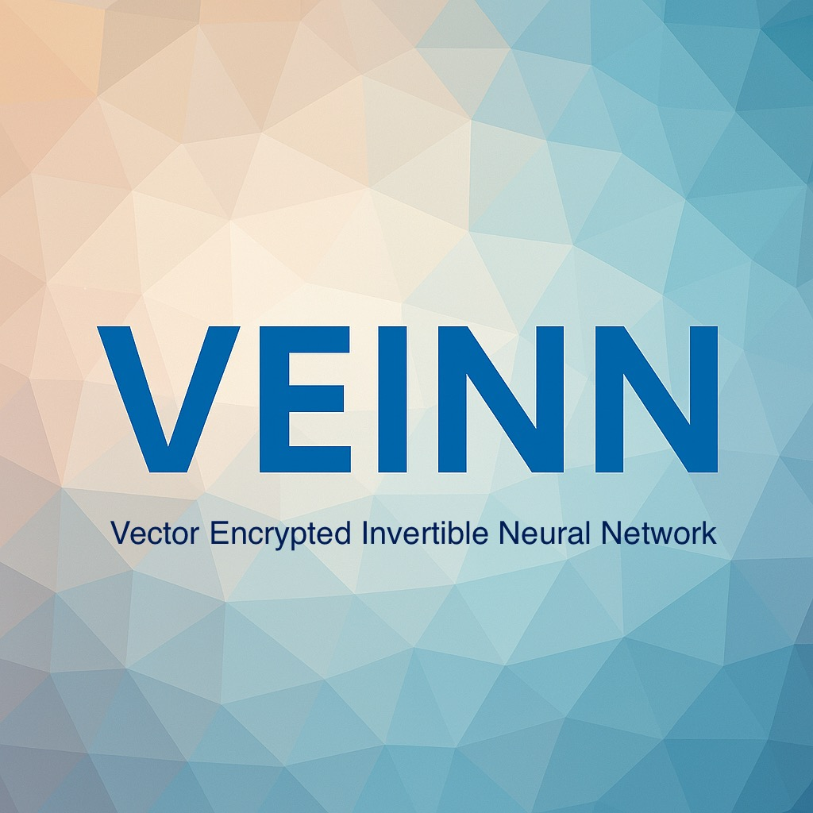

# VEINN: Vector Encrypted Invertible Neural Network

VEINN (Vector Encrypted Invertible Neural Network) is an **experimental
symmetric encryption design** that applies concepts from both
**cryptography** and **invertible neural networks**.

Unlike traditional ciphers such as AES (128-bit block) or ChaCha20
(stream cipher), VEINN works on **large vector states** (e.g., hundreds
or thousands of elements) and transforms them through a sequence of
**invertible layers**. The goal is to combine:

-   **Wide-block encryption** -- improving resistance against
    cut-and-paste and block manipulation attacks.
-   **Post-quantum readiness** -- integration with lattice-based key
    exchange (KEM/DEM).
-   **Novel cryptographic primitives** -- inspired by algebraic
    structures and neural network design.

------------------------------------------------------------------------

## Features

- 🔒 **Large block size**: typical instance uses `n = 512` words (~4 KB state).
- 🔄 **Invertible layers**: every round is invertible by design.
- 🧮 **Algebraic S-boxes**: nonlinear layer using modular inverse in a finite field.
- ⚡ **Fast mixing**: intra-block diffusion via NTT convolution.
- 🧑‍💻 **Reference Python implementation** with clarity > performance.
- 📊 **Built-in test harness**: avalanche testing, S-box analysis, NTT validation. (Coming soon) 

------------------------------------------------------------------------

## Core Mathematical & Cryptographic Principles

### 1. Modular Arithmetic over a Prime Field

All operations are performed modulo a large prime `q`.
This provides a clean algebraic structure (a finite field), which
ensures invertibility of multiplicative operations and supports modular
inverse S-boxes.

### 2. Invertible Coupling Layers

Borrowed from invertible neural networks (e.g., RealNVP, Glow):
- The state vector is split into halves `(x1, x2)`.
- One half is updated using a function of the other, then roles are
swapped.
- These transformations are inherently invertible, ensuring
reversibility for encryption/decryption.

### 3. Nonlinear Substitution (S-box Layer)

Nonlinearity is introduced by applying a **modular inverse S-box**
elementwise:

\[ y = x\^{-1} `\pmod `{=tex}q \]

This acts like the AES S-box but over a large finite field, ensuring
algebraic complexity and confusion.

### 4. Diffusion via NTT Convolution

VEINN uses the **Number Theoretic Transform (NTT)** to mix elements of
the state:
- Similar to the FFT, but defined over modular arithmetic.
- Ensures that small changes in input propagate across the entire state
vector.
- Provides strong diffusion and algebraic structure useful for
cryptographic mixing.

### 5. Key Injection

At each round, subkeys derived from the master key are injected via
addition or multiplication modulo `q`.
This ensures dependence on secret key material at every transformation
step.

### 6. Round Composition

Each round consists of: 
1. Coupling layer (invertible transformation).
2. Nonlinear modular inverse S-box.
3. NTT-based mixing / permutation.
4. Key injection.

Decryption is simply the inverse sequence of these steps.

------------------------------------------------------------------------

## Why This Matters

-   **Novelty**: Introduces neural-network-style invertible layers into
    symmetric cryptography.
-   **Security Goals**: Wide-block design for stronger resistance
    against structural attacks.
-   **Post-Quantum Context**: Intended for use with lattice-based KEMs
    in hybrid encryption.
-   **Research Value**: Serves as a testbed for exploring the fusion of
    algebraic cryptography and ML-inspired invertibility.

------------------------------------------------------------------------

## Summary

VEINN is **not a drop-in AES replacement**, but a **research-oriented
cipher construction**.
It demonstrates how modular arithmetic, NTT-based mixing, and invertible
neural network principles can be combined to build a new family of
wide-block encryption schemes.

------------------------------------------------------------------------

**Note**: This project is purely experimental. The security of VEINN has
not been formally established.

------------------------------------------------------------------------

## How It Works

A VEINN encryption round consists of:

1.  **Coupling Layer**
    -   The state vector is split into two halves `(x1, x2)`.
    -   One half is updated based on the other using modular arithmetic,
        convolutions, and nonlinearities.
    -   Structure ensures invertibility (like RealNVP or Glow in ML).
2.  **Nonlinear Layer (S-box)**
    -   Each element is transformed with a modular inverse function:
        `y = x⁻¹ mod q` (with special handling for zero).
    -   This provides nonlinearity and confusion, analogous to AES
        S-boxes.
3.  **Mixing / Permutation**
    -   The vector is permuted or mixed using **NTT-based
        convolutions**.
    -   This spreads information across all positions, ensuring
        diffusion.
4.  **Key Injection**
    -   Key material is added or multiplied into the state at each
        round.

Repeat these steps for multiple rounds (e.g. 12--20). Decryption works
by running the exact inverse of each step in reverse order.

------------------------------------------------------------------------

## Why VEINN?

-   **Wide-block security**: Resists cut-and-paste and
    block-rearrangement attacks that plague small-block ciphers.
-   **Post-quantum integration**: Designed to be paired with
    lattice-based KEMs (e.g., Kyber) as a DEM in hybrid encryption.
-   **Novel construction**: Bridges machine learning concepts
    (invertible networks) with cryptographic design.
-   **Strong diffusion**: NTT convolution mixes entire vectors quickly.

------------------------------------------------------------------------

## Example Use Cases

-   Encrypting large database fields or disk sectors as a single block.
-   Serving as the symmetric component in **PQ KEM/DEM hybrids**.
-   A research platform for testing ML-inspired invertible layers in
    crypto.

------------------------------------------------------------------------

## Getting Started

``` bash
git clone https://github.com/caelumsculptoris/veinn
cd veinn
python3 -m venv veinn
source bin/activate
pip install -r requirements.txt
python3 -m src.main
```
------------------------------------------------------------------------

## Security Notes

-   No formal proofs of security yet. (Potentially reduces to RLWE)
-   Needs analysis against differential, linear, algebraic, and
    structural attacks.
-   Provided *solely* as a research artifact. Do not deploy in
    production.

------------------------------------------------------------------------

## Citation

If you use VEINN in academic work:

    @misc{veinn2025,
      title   = {VEINN: Vector Encrypted Invertible Neural Network},
      author  = {Cal Sculptoris},
      year    = {2025},
      note    = {Research prototype, https://github.com/caelumsculptoris/veinn}
    }

------------------------------------------------------------------------

## License

MIT License --- see [LICENSE](LICENSE).
